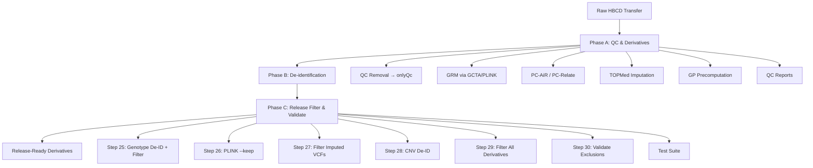

# HBCD Genomic Release Pipeline

```{image} _static/logo.png
:alt: HBCD Genomic Release Pipeline
:width: 200px
:align: center
```

**Version**: 0.1.0 | **Target Release**: br31p2 | **License**: Apache 2.0

---

The HBCD Genomic Release Pipeline is a comprehensive workflow for de-identifying, filtering, and validating genomic data for the HEALthy Brain and Child Development (HBCD) Study data releases. This pipeline transforms raw genomic data (PLINK format, imputed VCFs, CNV calls) into release-ready derivatives that comply with HBCD data standards and participant privacy requirements.

## Key Features

- **Three-phase architecture**: QC & derivatives → De-identification → Release filtering & validation
- **Comprehensive de-identification**: Maps raw PSCIDs to anonymous `release_candid` integers
- **Multi-source exclusion handling**: Integrates QC failures, Excel exclusions, and CSV exclusion lists
- **Derivative filtering**: Filters GRM, PC-AiR, PC-Relate, CNV, and imputed VCFs to release subjects
- **Validation suite**: 35+ automated tests ensuring no excluded subjects leak into outputs
- **Reproducible**: Version-controlled, container-ready, with full provenance tracking

## Pipeline Overview



## Quick Start

```bash
# Clone the repository
git clone https://github.com/hbcd-genomics/hbcd-genomic-release.git
cd hbcd-genomic-release

# Set up environment
conda create -n hbcd-genomic-release python=3.10
conda activate hbcd-genomic-release
pip install -e ".[dev]"

# Or use the shared HBCD environment
source ~/miniconda3/etc/profile.d/conda.sh
conda activate gdcPipeline
module load plink/2.00-alpha-091019
module load bcftools
module load R/4.4.2-openblas-rocky8

# Configure release
export HBCD_RELEASE=br31p2
export HBCD_DATA_DIR=/projects/standard/basu_hbcd/shared/data
export HBCD_IMPUTATION_DIR=/projects/standard/basu_hbcd/shared/hbcdSandboxData

# Run complete Phase C pipeline
./run_release_pipeline.sh
```

## Documentation Contents

```{toctree}
:maxdepth: 2
:caption: User Guide

installation
quickstart
configuration
running
outputs
```

```{toctree}
:maxdepth: 2
:caption: Pipeline Reference

phases/phase_a
phases/phase_b
phases/phase_c
scripts/index
```

```{toctree}
:maxdepth: 2
:caption: Validation & Testing

testing
exclusion_validation
troubleshooting
```

```{toctree}
:maxdepth: 1
:caption: Development

contributing
changelog
license
```

## Citation

If you use this pipeline in your research, please cite:

```bibtex
@software{hbcd_genomic_release_2024,
  author       = {HBCD Genomics Team},
  title        = {HBCD Genomic Release Pipeline},
  version      = {0.1.0},
  year         = {2024},
  publisher    = {Zenodo},
  doi          = {10.5281/zenodo.XXXXXXX},
  url          = {https://github.com/hbcd-genomics/hbcd-genomic-release}
}
```

## Support

- **Issues**: [GitHub Issues](https://github.com/hbcd-genomics/hbcd-genomic-release/issues)
- **Documentation**: [Read the Docs](https://hbcd-genomic-release.readthedocs.io/)
- **HBCD Genomics Team**: hbcd-genomics@umn.edu

## License

This project is licensed under the Apache License 2.0 - see the [LICENSE](license) file for details.