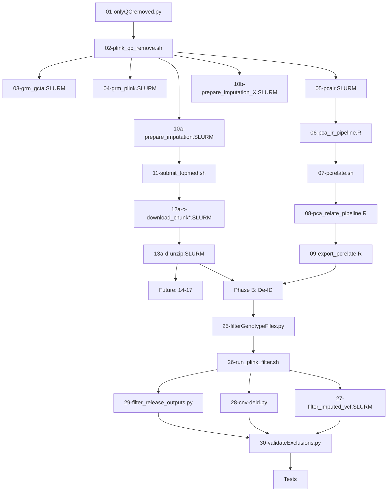

# Script Reference

Complete reference for all pipeline scripts, organized by phase.

## Phase A: QC & Derivatives (Scripts 01-17)

| Script | Type | Description |
|--------|------|-------------|
| [`01-onlyQCremoved.py`](phase_a_scripts.md#01-onlyqcremovedpy) | Python | QC removal → `QC_removed.txt` |
| [`02-plink_qc_remove.sh`](phase_a_scripts.md#02-plink_qc_removesh) | Bash | PLINK2 `--remove` → `onlyQc` |
| [`03-grm_gcta.SLURM`](phase_a_scripts.md#03-grm_gctaslurm) | SLURM | GCTA GRM (array 1-22) |
| [`04-grm_plink.SLURM`](phase_a_scripts.md#04-grm_plinkslurm) | SLURM | PLINK2 GRM |
| [`05-pcair.SLURM`](phase_a_scripts.md#05-pcairslurm) | SLURM | PC-AiR wrapper |
| [`06-pca_ir_pipeline.R`](phase_a_scripts.md#06-pca_ir_pipeliner) | R | PC-AiR implementation |
| [`07-pcrelate.sh`](phase_a_scripts.md#07-pcrelatesh) | Bash | PC-Relate wrapper |
| [`08-pca_relate_pipeline.R`](phase_a_scripts.md#08-pca_relate_pipeliner) | R | PC-Relate implementation |
| [`09-export_pcrelate.R`](phase_a_scripts.md#09-export_pcrelater) | R | Export GRM/IBD to handoff |
| [`10a-prepare_imputation.SLURM`](phase_a_scripts.md#10a-prepare_imputationslurm) | SLURM | Autosome VCF prep (array 0-22) |
| [`10b-prepare_imputation_X.SLURM`](phase_a_scripts.md#10b-prepare_imputation_xslurm) | SLURM | ChrX VCF prep |
| [`11-submit_topmed.sh`](phase_a_scripts.md#11-submit_topmedsh) | Bash | TOPMed submission |
| [`12a-download_chunk1.SLURM`](phase_a_scripts.md#12a-download_chunk1slurm) | SLURM | Download chunk 1 |
| [`12b-download_chunk2.SLURM`](phase_a_scripts.md#12b-download_chunk2slurm) | SLURM | Download chunk 2 |
| [`12c-download_chunk3.SLURM`](phase_a_scripts.md#12c-download_chunk3slurm) | SLURM | Download chunk 3 |
| [`13a-unzip.SLURM`](phase_a_scripts.md#13a-unzipslurm) | SLURM | Unzip chunk 1 (array 1-7) |
| [`13b-unzip.SLURM`](phase_a_scripts.md#13b-unzipslurm) | SLURM | Unzip chunk 2 |
| [`13c-unzip.SLURM`](phase_a_scripts.md#13c-unzipslurm) | SLURM | Unzip chunk 3 |
| [`13d-unzip.SLURM`](phase_a_scripts.md#13d-unzipslurm) | SLURM | Unzip chrX |

### Future Scripts (Phase A Extensions)

| Script | Type | Description |
|--------|------|-------------|
| [`futureScripts/14a-precompute_gp.SLURM`](phase_a_scripts.md#14a-precompute_gpslurm) | SLURM | GP precompute (chr × ancestry) |
| [`futureScripts/15-aggregate_gp.SLURM`](phase_a_scripts.md#15-aggregate_gpslurm) | SLURM | GP aggregation |
| [`futureScripts/16-imputation-quality-report.qmd`](phase_a_scripts.md#16-imputation-quality-reportqmd) | Quarto | Imputation QC report |
| [`futureScripts/17-cnv-qc-report.qmd`](phase_a_scripts.md#17-cnv-qc-reportqmd) | Quarto | CNV genomic profile report |
| [`futureScripts/17-cnv-qc-report.SLURM`](phase_a_scripts.md#17-cnv-qc-reportslurm) | SLURM | CNV report on SLURM |

## Phase B: De-identification

| Script | Type | Description |
|--------|------|-------------|
| *(Not yet in repo)* | Python | Batch de-ID of Phase A outputs |

## Phase C: Release Filter & Validate (Scripts 25-30)

| Script | Type | Description |
|--------|------|-------------|
| [`25-filterGenotypeFiles.py`](phase_c_scripts.md#25-filtergenotypefilespy) | Python | Genotype de-ID + filter → `keep_list.txt`, `temp.fam` |
| [`26-run_plink_filter.sh`](phase_c_scripts.md#26-run_plink_filtersh) | Bash | PLINK2 `--keep` → `merged_chroms` |
| [`27-filter_imputed_vcf.SLURM`](phase_c_scripts.md#27-filter_imputed_vcfslurm) | SLURM | Filter imputed VCFs (array 0-23) |
| [`28-cnv-deid.py`](phase_c_scripts.md#28-cnv-deidpy) | Python | CNV de-identification |
| [`29-filter_release_outputs.py`](phase_c_scripts.md#29-filter_release_outputspy) | Python | Filter all derivatives to release |
| [`30-validateExclusions.py`](phase_c_scripts.md#30-validateexclusionspy) | Python | Validate no excluded subjects |

## Utility Scripts

| Script | Type | Description |
|--------|------|-------------|
| [`run_release_pipeline.sh`](utility_scripts.md#run_release_pipelinesh) | Bash | Phase C wrapper (25→30) |
| [`_lib.py`](utility_scripts.md#_libpy) | Python | Shared library (paths, loaders) |
| [`compute_gp_stats.py`](utility_scripts.md#compute_gp_statspy) | Python | GP statistics computation |
| [`test_ancestry.R`](utility_scripts.md#test_ancestryr) | R | Ancestry analysis |

## Test Scripts

| Script | Type | Description |
|--------|------|-------------|
| [`tests/test_release_data.py`](test_scripts.md#test_release_datapy) | Python | De-ID integrity, data validation |
| [`tests/test_exclusions.py`](test_scripts.md#test_exclusionspy) | Python | Exclusion compliance validation |
| [`tests/conftest.py`](test_scripts.md#conftestpy) | Python | Pytest configuration |

## Quick Reference: Script Dependencies



## Running Order

### Phase A (once):
```bash
01 → 02 → 03,04,05 → 07 → 09 → 10a,10b → 11 → 12a-c → 13a-d → 14-17
```

### Phase B (once, after Phase A):
```bash
deidentify_phase_a.py  # Not yet in repo
```

### Phase C (per release):
```bash
25 → 26 → 27 (SLURM) → 28 → 29 → 30 → Tests
# Or: ./run_release_pipeline.sh
```

## Environment Requirements

| Script | Python | R | PLINK2 | bcftools | GCTA | KING | SLURM |
|--------|--------|---|--------|----------|------|------|-------|
| 01, 25, 28, 29, 30 | ✓ | | | | | | |
| 02, 07, 11, 26 | | | ✓ | | | | |
| 03 | | | | | ✓ | | ✓ |
| 04, 10a, 10b, 26 | | | ✓ | | | | |
| 05, 06 | | ✓ | | | | ✓ | ✓ |
| 07, 08 | | ✓ | | | | | ✓ |
| 09 | | ✓ | | | | | |
| 11 | | | | | | | |
| 12a-c, 13a-d | | | | | | | ✓ |
| 14, 15, 17 | | | | | | | ✓ |
| 16, 17 (qmd) | | ✓ | | | | | |
| 27 | | | | ✓ | | | ✓ |
| Tests | ✓ | | ✓ | ✓ | | | |

## Common Patterns

### SLURM Array Jobs
```bash
# Submit array
sbatch --array=1-22 script.SLURM

# Monitor
squeue -u $USER --name=job_name

# Cancel array
scancel <job_id>_*
```

### Conda Environment
```bash
source ~/miniconda3/etc/profile.d/conda.sh
conda activate gdcPipeline
```

### Path Configuration
All scripts use `_lib.py` helpers:
```python
from _lib import DATA_DIR, get_release_dir, load_identifiers, ...
```
Environment variables:
- `HBCD_DATA_DIR` — Base data directory
- `HBCD_IMPUTATION_DIR` — Imputation data directory
- `HBCD_RELEASE` — Release tag